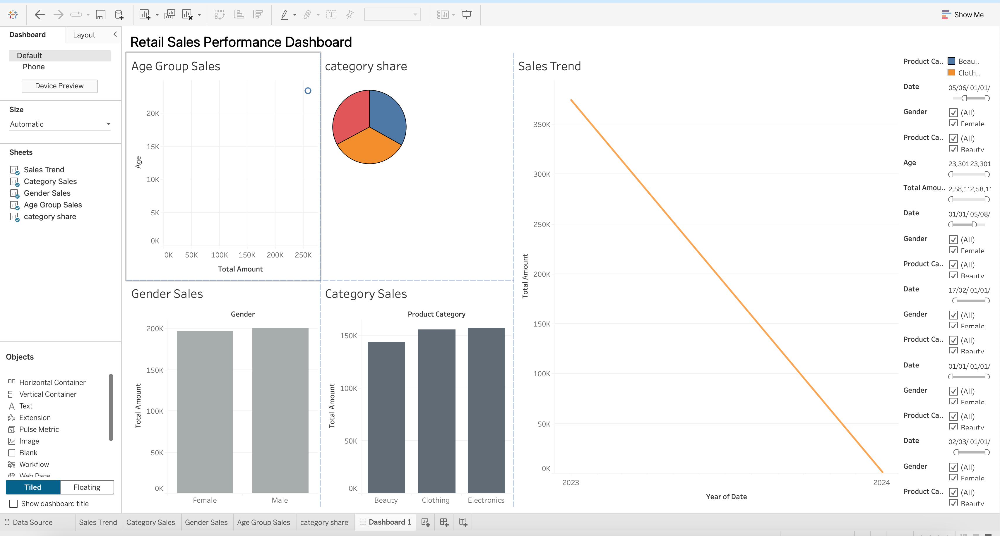

# Retail-Sales-Dashboard

## 📊 Project Overview
This project analyzes retail sales data using data visualization techniques.

## 📁 Dataset
Retail sales dataset in CSV format.

## 📌 Features
- Sales trend analysis
- Category-wise sales
- Gender-based analysis
- Age group segmentation

## 📷 Dashboard
Below is the dashboard created using Tableau:

## 🛠 Tools Used
- Tableau
- CSV Dataset

## 🔗 Conclusion
The dashboard helps in understanding sales trends and supports data-driven decisions.
